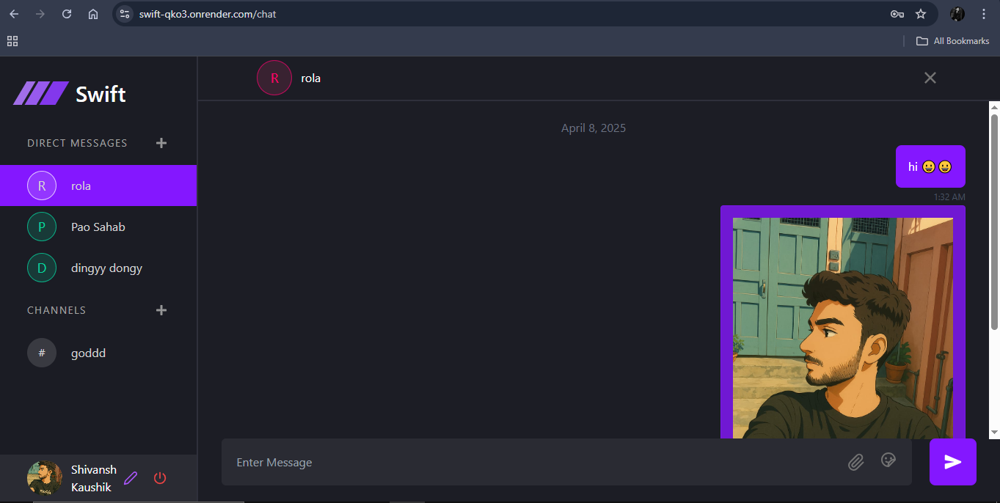

# 🚀 Swift Chat

Swift Chat is a **real-time chat application** built with modern web technologies. It offers a seamless chatting experience with support for **direct messages**, **channels**, and **file sharing**. With a sleek UI powered by **ShadCN UI**, beautiful animations from **Lottie**, and real-time updates via **Socket.IO**, Swift Chat is fast, responsive, and scalable. Please do give it a try!!!

---

## 🛠️ Tech Stack

- **Frontend**: [Vite](https://vitejs.dev/), [ShadCN UI](https://ui.shadcn.com/), [Lottie](https://lottiefiles.com/)
- **Backend**: [Node.js](https://nodejs.org/), [Socket.IO](https://socket.io/), [MongoDB](https://www.mongodb.com/)
- **Authentication**: [JWT (JSON Web Tokens)](https://jwt.io/)


---

## ✨ Features

### 💬 Direct Messages  
Chat one-on-one in real-time with any user in the system.

### 📢 Channels  
Join or create channels to have group discussions with like-minded people.

### 📁 File Sharing  
Easily share documents, images, and more within chats or channels.

### 🧩 Real-Time Updates  
All interactions happen in real-time thanks to **Socket.IO**.

### 🔐 Secure Auth  
JWT-based authentication to keep user sessions secure and stateless.

### 💅 Polished UI  
Modern and responsive UI using ShadCN components, with rich animations via Lottie.

---

## 🖼️ Screenshots

> 

---

##   Getting Started


### 🔧 Setup Instructions

1. **Clone the repository**
   ```bash
   git clone https://github.com/your-username/swift-chat.git
   cd swift-chat
   ```

2. **Install dependencies for server**
   ```bash
   cd server
   npm install
   cd ..
   ```
   
2. **Install dependencies for client**
   ```bash
   cd client
   npm install
   cd ..
   ```

3. **Environment Variables**

   Create a `.env` file in the server directory:

   ```env
   DATABASE_URL = paste your mongodb connection string here 
   JWT_KEY = paste your jwt secret key
   PORT = 8747
   ORIGIN = paste your frontend URL
   ```

4. **Run the development server**
   ```bash
   cd server
   npm run dev
   ```
   Open new terminal
   ```bash
   cd client
   npm run dev
   ```
---


---

## 🚀 Deployment

I have deployed this app on:

- **Frontend**: Render
- **Backend**: Render 
- **Database**: MongoDB Atlas

Make sure to set the appropriate environment variables in production.

---

## 🙌 Contributions

Feel free to open issues or submit pull requests!  
Let’s make **Swift Chat** better together. 🤝

---


## ✉️ Contact

For any queries or suggestions, reach out:
  
  **Shivansh kaushik**
 
 📧 shivanshkaushik1237@gmail.com  
🔗 [LinkedIn](www.linkedin.com/in/shivansh-kaushik-b3165827a)
